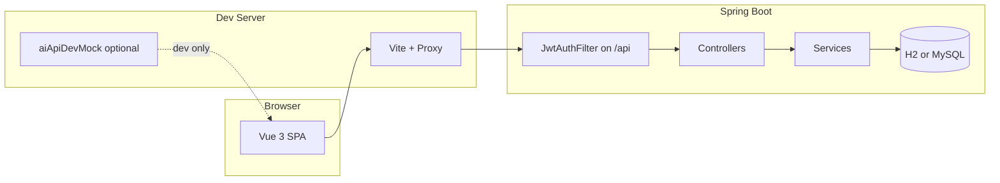

# medican（校园药膳推荐）

## 1. 引入区（约 3 秒）

**一体化校园场景**：浏览器里的学生端 / 管理端 + 可本地零依赖跑起的 Spring Boot API + 可选 MySQL 与内网大模型；默认 **内存 H2** 即可联调前端，不必先搭数据库。

---

## 2. 电梯演讲

**本仓库与「只做静态演示页 / 只接公网大模型 API / 无药膳与校园业务域模型」方案的核心差异**：把 **药膳推荐、体质问卷、食堂周历、收藏与反馈、管理端内容治理** 等放在同一套 **可运行、可测、可观测（Actuator/Prometheus）** 的后端契约上，前端用 **Vite 多键代理** 统一 `/api` 与 base URL，开发期还可 **AI Mock** 脱网演示。

---

## 3. 使用场景矩阵（何时用本仓库更合适）

| 场景 | 用本仓库 | 用「更原生」的替代 |
|------|----------|-------------------|
| 毕业设计 / 答辩需要**可点击的完整业务闭环** | 前后端齐、脚本与手册在 `docs/handbook` | 纯静态页 + 假数据，演示深度弱 |
| 本地开发要**快速起服务**、少装 MySQL | `SPRING_PROFILES_ACTIVE=h2`（默认），双击 `启动后端.bat` | 自建库、手写迁移与种子 |
| 需要 **JWT + 角色** 的管理端与学生端分流 | 已集成过滤器与种子用户 | 每个项目从零写安全与路由守卫 |
| 大模型在内网 / 本机，**前端仍要可跑** | `VITE_AI_MOCK` 未设为 `0` 时走 Vite 插件 mock | 前端强依赖公网 key，联调成本高 |
| 运维探活 / CI 门禁 | `/health`、`/api/health`、`/api/health/db` 分层 | 仅根路径或仅 200，无 DB 语义 |
| 交付离线 zip / Windows 批处理友好 | `scripts/Build-MedicanDeliveryZip.ps1`、`启动*.bat` | 仅 Docker 或仅 Unix 脚本 |

---

## 4. 演示与对比（可视化）

### 4.1 终端录屏（建议由维护者补充）

本仓库**不是**发布到 npm 的 CLI 包；若需展示「一条命令起后端 + 探活 + 起前端」，可自行录制 **asciinema** 或 **GIF**，推荐脚本顺序示例（命令保持原文）：

```bash
# 终端 A：仓库根
powershell -NoProfile -ExecutionPolicy Bypass -File .\scripts\Run-BackendTests.ps1 -SecurityOnly

# 终端 B：后端（或用 启动后端.bat）
cd campus-diet-backend
.\mvnw.cmd -s ..\maven-settings-d.xml spring-boot:run

# 终端 C：前端
cd tcm-diet-frontend
npm install
npm run dev
```

将录屏链接贴在 Issue/答辩材料或本段下方即可。

### 4.2 代码前后对比（联调形态：代理统一 vs 手写基地址）

**引入本仓库的前端代理约定后**，不必在每个请求里拼接「协议 + 主机 + 端口 + 前缀」；开发服务器把 **`VITE_API_PREFIX`**（默认 `/api`）和 **`VITE_API_BASE_URL`**（同源相对路径写法）一并转发到 **`VITE_PROXY_TARGET`**（默认 `http://127.0.0.1:11888`），避免前缀与 base 不一致时请求落到 Vite 静态层 **404**。

**前（示意，每个调用点都易错）：**

```ts
const base = import.meta.env.VITE_API_BASE_URL ?? 'http://127.0.0.1:11888'
const res = await fetch(`${base}/api/campus/scenes`)
```

**后（示意，与仓库内 axios 封装思路一致）：**

```ts
const res = await http.get('/campus/scenes') // baseURL=/api，由代理转到 11888
```

行数随项目增长差异会更明显；核心收益是 **单一事实来源**（环境变量 + `vite.config.js`）与 **更少硬编码主机**。

---

## 5. 安装与兼容性（消除环境困惑）

### 5.1 前端：多包管理器（`tcm-diet-frontend`）

仓库已提交 **`package-lock.json`**，**以 npm 为可复现安装的一等选择**；其余管理器通常可用，但锁文件不会自动同步。

| 管理器 | 安装命令 | 备注 |
|--------|----------|------|
| npm | `npm install` | 与 CI、锁文件一致，推荐 |
| yarn | `yarn install` | 可能生成 `yarn.lock`，勿与 npm 混提交 |
| pnpm | `pnpm install` | 需 `pnpm` 本机已安装 |
| bun | `bun install` | 速度快；若遇个别包解析差异，回退 npm |

开发服务（见 `package.json`）：

```bash
cd tcm-diet-frontend
npm run dev
```

### 5.2 运行时与工具链版本（摘要）

| 组件 | 版本 / 要求 | 说明 |
|------|----------------|------|
| Node.js（前端） | **18+** 推荐（与 Vite 6、工具链匹配） | `AGENTS.md` 亦建议 18+ |
| JDK（后端） | **11**（与 `campus-diet-backend/pom.xml` 一致） | 勿用 JRE 8 跑 Maven |
| Maven | **3.9.x** 推荐；无全局 Maven 时用 **`mvnw.cmd`** | 见 `maven-settings-d.xml` |
| Spring Boot | **2.7.18** | parent 于 `pom.xml` |
| 浏览器 | 现代 Chromium / Firefox / Safari | 管理端 Element Plus；移动端 Vant |

**本仓库前端 `package.json` 为 `private: true` 应用包，未声明 npm `peerDependencies`**。若你在**别的项目**中引用本前端源码进行二次开发，需自行对齐 **Vue 3、Vue Router 4、Pinia、Vite 6** 等主版本，避免多实例 Vue。

**后端无 Node/Deno 运行时要求**；数据库 **MySQL 可选**（profile `mysql`），默认 **H2 内存库**即可跑通多数联调。

### 5.3 后端与数据库（Windows 要点）

- **便携 JDK/Maven**：推荐设置 **`MEDICAN_DEV_TOOLS`**（如 `C:\dev`），与 **`scripts/Use-RepoJavaMaven.ps1`**、`启动后端.bat` 一致。详见 **`AGENTS.md`**。
- **MySQL**：可选；连接、授权脚本、`docker-compose.mysql-dev.yml` 等说明见下文「快速启动」与 **`AGENTS.md`**。

---

## 6. API 参考（HTTP 契约；阅读量最大的实用索引）

以下为**对外稳定、适合写进联调与监控**的端点；业务接口众多，完整列表以 `campus-diet-backend/src/main/java/com/campus/diet/controller/**/*.java` 为准。

### 6.1 通用业务响应包（多数 `/api/**` 业务 JSON）

后端广泛使用 `ApiResponse<T>`：

```ts
/** 与 Java `com.campus.diet.common.ApiResponse` 对齐的 JSON 契约 */
interface ApiResponse<T> {
  code: number
  msg: string
  data: T | null
}
```

成功时常为 `code === 200` 且 `msg === "success"`（以实际控制器返回为准）。

### 6.2 探活与健康（不经过业务 JWT 鉴权）

#### `GET /health`

| 项目 | 说明 |
|------|------|
| 参数 | 无 |
| 返回 | **同步**；`Content-Type: text/plain`，body 为字面量 **`ok`** |
| 典型用途 | 负载均衡最小探活 |

#### `GET /api/health`

| 参数名 | 类型 | 必填 | 默认值 | 描述 |
|--------|------|------|--------|------|
| （无） | — | — | — | — |

**返回值（JSON）**：

```ts
interface ApiHealthJson {
  status: 'ok'
}
```

同步；HTTP **200**。

#### `GET /api/health/db`

| 参数名 | 类型 | 必填 | 默认值 | 描述 |
|--------|------|------|--------|------|
| （无） | — | — | — | 探测应用能否访问 `sys_user` 表 |

**返回值（JSON，成功示例）**：

```ts
interface ApiHealthDbOk {
  status: 'ok'
  db: 'up'
  sysUserCount: number
}
```

**错误与 HTTP 状态（模块语义）**：

| HTTP | `status`（body） | 含义与处理建议 |
|------|------------------|----------------|
| **200** | `ok` | 库可达；`sysUserCount` 可为 0（空库仍健康） |
| **503** | `error` | 库不可用或 SQL 失败；检查 JDBC、表是否存在、`SPRING_SQL_INIT_MODE` |
| **501** | `not_supported` | 无 `SysUserMapper`（例如单元测试里直接 new 控制器）；测试里 mock Mapper 或改测集成测试 |

实现见：

```24:60:campus-diet-backend/src/main/java/com/campus/diet/controller/HealthController.java
    @GetMapping("/health")
    public String health() {
        return "ok";
    }
    // ...
    @GetMapping("/api/health/db")
    public ResponseEntity<Map<String, Object>> apiHealthDb() {
```

### 6.3 业务路由索引（节选）

| 方法 | 路径前缀 | 说明 |
|------|-----------|------|
| GET | `/api/campus/scenes` | 校园场景列表等 |
| GET | `/api/campus/weekly-calendar` | 周历 |
| GET | `/api/scenes` | 场景疗愈相关 |
| GET/POST | `/api/user/*` | 用户资料、体质问卷、收藏与历史 |
| GET/POST | `/api/admin/*` | 管理端（通常需 JWT） |
| POST | `/api/feedback` | 反馈 |

**业务错误体**：全局异常处理会返回 `ApiResponse` 形态，`code` 可能为非 200（如校验失败 **400**、业务码、未处理异常 **500**）。具体 `BizException` 码表见各业务服务与 `GlobalExceptionHandler`。

---

## 7. 高级用法与食谱

### 7.1 与「Express / 其它 BFF」组合

本仓库默认 **Vue 直连 Spring Boot**（开发期经 Vite 代理）。若需 **Node BFF**：在 Express 中对浏览器暴露 `/api`，由 BFF **转发**到 `http://127.0.0.1:11888`，并统一处理 Cookie / CSRF / 限流；前端将 **`VITE_PROXY_TARGET`** 指向 BFF 地址即可，保持浏览器仍只认同源 `/api`。

### 7.2 Webpack 插件

当前前端构建为 **Vite**，无 Webpack 配置；若迁移到 Webpack，需自行配置 **devServer.proxy** 等价于 `vite.config.js` 中的多键代理逻辑。

### 7.3 大模型与 AI Mock

- 后端：环境变量 **`LLM_URL`** 或 **`LLM_HTTP_HOST`/`LLM_HTTP_PORT`**、**`LLM_MODEL`**、**`LLM_API_KEY`** 等（见 `application.yml` 与 `docs/handbook/大模型调用调试说明.md`）。
- 前端：开发模式下 **`VITE_AI_MOCK` 未设为 `0`** 时加载 `vite-plugins/aiApiDevMock.js`（见 `AGENTS.md`）。

### 7.4 同步 mock 药膳 JSON

```bash
cd tcm-diet-frontend
npm run sync:backend-mock-json
```

将前端 `MOCK_RECIPES` 写回后端 `bootstrap/mock-recipes.json`。

---

## 8. 单测与 Mock 指南（测试环境）

| 层级 | 做法 |
|------|------|
| 后端单元 / 切片测试 | Spring **`MockMvc`**、`@WebMvcTest`、对 `JwtAuthFilter` 与控制器已有测试可参考 `campus-diet-backend/src/test/java` |
| 前端单元测试 | `npm run test`（`tsx --test`）；对 `fetch`/axios 使用注入 client 或 mock 模块 |
| 前端 E2E | `npm run test:e2e`（Playwright）；CI 门禁 `npm run test:e2e:ci` 见 `package.json` 与 `AGENTS.md` |
| 无 DB 的控制器单测 | `HealthController` 无 Mapper 时 **501** 为预期行为；集成测走 Spring 上下文 |

---

## 9. 开发 / 贡献指南（面向合作者）

### 9.1 `npm run dev` 做了什么（前端）

1. **`predev`**：执行仓库根 **`scripts/dev-backend-probe.mjs`**（探活后端，避免静默连不上 API）；随后检查 `node_modules` 中关键包，不完整则 **`npm install`**。
2. **`dev`**：`vite --mode development`，端口 **`11999`**（`strictPort: true`，见 `vite.config.js`）。

### 9.2 架构关系（Mermaid）



### 9.3 发布流程（Tag 与 Changelog）

本应用版本见 **`campus-diet-backend/pom.xml`**（`1.0.0-SNAPSHOT`）与前端 **`package.json`**（`0.0.1`）；发布非 npm 包发布，建议：

1. **冻结版本号**：后端 `pom.xml` 去 `-SNAPSHOT` 或打 release；前端 `package.json` `version` 与交付物一致。
2. **打 Tag**：`git tag -a vX.Y.Z -m "release: ..."`，`git push origin vX.Y.Z`。
3. **Changelog**：用 `git log` 或 **Conventional Commits** 汇总；或将本周期说明写入 `docs/handbook/项目交付手册.md` 的修订记录。
4. **离线包**：`scripts/Build-MedicanDeliveryZip.ps1`（输出目录见下文「仓库结构」）。

---

## 10. 当前主路线与文档索引（先看这里）

单人维护时仍建议固定「默认看哪几份清单」，避免多份分析文档互相抢注意力：

| 用途 | 文档 |
|------|------|
| 产品能力、角色与使用方式 | [`docs/handbook/产品手册.md`](docs/handbook/产品手册.md) |
| 交付范围、验收、离线 zip、生产基线 | [`docs/handbook/项目交付手册.md`](docs/handbook/项目交付手册.md) |
| 前端/测试缺口、构建与仓库卫生（C-1） | [`docs/C-1-未完成事项.md`](docs/C-1-未完成事项.md) |
| CI、typecheck、后端 Wrapper、安全基线进度（路径 2） | [`docs/handbook/路径2-未完成项清单.md`](docs/handbook/路径2-未完成项清单.md) |
| 问题归纳与优先级（与上两者互补） | [`docs/handbook/优化pro.md`](docs/handbook/优化pro.md) |
| 项目级优化建议（与 `优化pro` 互补） | [`docs/handbook/项目优化方向建议.md`](docs/handbook/项目优化方向建议.md) |
| 本地 JDK/Maven、端口、脚本约定 | [`AGENTS.md`](AGENTS.md) |
| AI Skill 与问答演进专项 | [`docs/handbook/AI问答与Skill集成优化方向.md`](docs/handbook/AI问答与Skill集成优化方向.md) |
| 仓库目录树（带注释） | [`docs/仓库目录树.md`](docs/仓库目录树.md) |
| 部署与运行环境说明 | [`docs/deployment.md`](docs/deployment.md) |
| 安全基线检查清单 | [`docs/security-baseline-checklist.md`](docs/security-baseline-checklist.md) |

---

## 11. 仓库结构（常用）

| 路径 | 说明 |
|------|------|
| `tcm-diet-frontend/` | 前端源码、`npm run dev` / `build` |
| `campus-diet-backend/` | 后端源码、Maven / `mvnw` |
| `scripts/` | `Use-RepoJavaMaven.ps1`、`Run-BackendTests.ps1`、`Build-MedicanDeliveryZip.ps1`、数据脚本等 |
| `docs/` | 未完成项、部署、API 契约、可观测与安全基线等 |
| `docs/handbook/` | 产品手册、交付/技术白皮书、路径清单、答辩材料等；`exports/` 下为 docx/html 导出件 |
| `docs/仓库目录树.md` | 仓库结构说明与带注释的目录树（维护时随目录变更更新） |
| `observability/` | 可观测性相关 compose 等（与 `docs/observability-*.md` 配套） |
| `plugins/` | Cursor 插件示例（如 `my-plugin`），与主应用独立 |
| `release/` | 离线交付 zip 输出目录（由 `scripts/Build-MedicanDeliveryZip.ps1` 生成，默认 gitignore） |
| `docker-compose.mysql-dev.yml` | 可选：本机 MySQL 容器化开发（与 bat/PowerShell 二选一即可） |
| `maven-settings-d.xml` | 本地 Maven 仓库等配置（与后端 `-s` 参数一致） |
| `mysql-dev-my.ini.template` | MySQL 开发配置模板；双击 `启动MySQL开发实例.bat` 生成 `mysql-dev-my.ini`（已 gitignore） |
| [`docs/handbook/大模型调用调试说明.md`](docs/handbook/大模型调用调试说明.md) | 内网/本机大模型联调说明 |

---

## 12. 快速启动 Web（推荐顺序）

1. **MySQL（可选）**：若只用 **`启动后端.bat` 默认的内存 H2**，可跳过本步。连真实库时默认连接 **`127.0.0.1:3306`**、库名 **`tcm_diet`**。**`application.yml` 默认用户 `tcm_app`、口令占位 `change-this-db-password`**；首次请用高权限账号创建库与用户：**在仓库根双击 `mysql授权tcm_app.bat`**（内部调用 `scripts/Run-MysqlGrantTcmApp.ps1`，避免在 `C:\Users\你` 下执行相对路径找不到 SQL）。也可在仓库根执行 `powershell -NoProfile -ExecutionPolicy Bypass -File .\scripts\Run-MysqlGrantTcmApp.ps1`（脚本会尝试 **PATH** 与 **`Program Files` 下 MySQL/MariaDB 的 `mysql.exe`**；未进 PATH 时可加 `-MysqlPath "...\mysql.exe"` 或设置用户环境变量 **`MEDICAN_MYSQL_EXE`** 指向 `mysql.exe`）。手工执行 SQL 时须先 **`cd` 到仓库根**，且 Windows 上不建议 `mysql -u root -p < scripts\...`（重定向与密码提示冲突），请用 `mysql ... -e "source D:/绝对路径/scripts/mysql-dev-grant-tcm_app.sql"`。另可复制 **`campus-diet-backend/config/medican-datasource.override.example.yml`** 为 **`medican-datasource.override.yml`**（**仅**在 **`SPRING_PROFILES_ACTIVE` 含 `mysql`** 时由 `application-mysql.yml` 加载；默认内存 **h2** 不会读该文件，避免误用 `tcm_app` 覆盖 H2 的 `sa`）。双击 **`启动后端.bat`** 且 **`set MEDICAN_USE_MYSQL=1`** 时会在缺失时自动生成 override。也可用环境变量 **`MYSQL_USERNAME` / `MYSQL_PASSWORD`** 或 **`SPRING_DATASOURCE_URL`**。JDBC 已带 **`createDatabaseIfNotExist=true`**，在账号具备 **CREATE** 权限时首次启动可自动建库。表结构见 **`classpath:db/schema.sql`**，启动时可选执行 **`data.sql`**（可用 **`SPRING_SQL_INIT_MODE=never`** 关闭）。安装 **MySQL Server**（如 `winget install -e --id Oracle.MySQL`）后，在仓库根双击 **`启动MySQL开发实例.bat`**：内部运行 **`scripts/Start-MysqlDev.ps1`**，自动探测 **`mysqld.exe`**、从模板生成本机 **`mysql-dev-my.ini`**、数据目录 **`.devtools/mysql-data`**，并在**首次**自动执行 **`--initialize-insecure`**（此模式下 **root 初始无口令**；**`mysql授权tcm_app.bat`** / **`Run-MysqlGrantTcmApp.ps1`** 会先自动尝试无口令连接并执行授权）。若 **3306** 已在监听则跳过启动。可设置 **`MEDICAN_MYSQLD_EXE`** 指向 `mysqld.exe`。

2. **后端**：默认 **`http://127.0.0.1:11888`**。健康检查：**`GET /health`**（返回纯文本 **`ok`**）；联调脚本与 JSON 断言一致的是 **`GET /api/health`**（`{"status":"ok"}`）；数据库自检 **`GET /api/health/db`**。Spring Boot Actuator 暴露 **`/actuator/health`**、**`/actuator/prometheus`**（见 `application.yml`）。默认仅监听 **`127.0.0.1`**；若需局域网访问后端，设置环境变量 **`SERVER_ADDRESS=0.0.0.0`**。Windows 根目录双击 **`启动后端.bat`**（默认 **`SPRING_PROFILES_ACTIVE=h2`**，**内存 H2、无需先配 MySQL**）；要连本机 **MySQL** 时请先 **`set MEDICAN_USE_MYSQL=1`** 再双击同一 bat，或在 **`campus-diet-backend`** 手动 **`mvn`** / **`.\mvnw.cmd -s ..\maven-settings-d.xml spring-boot:run`** 并自行指定 profile。Maven 本地仓库见 **`maven-settings-d.xml`** 的 `localRepository`。JDK / Maven 约定见 **`AGENTS.md`**。  
   **无全局 Maven 时**：本仓库已包含 **Maven Wrapper**（`campus-diet-backend/mvnw`、`mvnw.cmd`、`.mvn/wrapper/maven-wrapper.properties`），仅需 **JDK 11** 与网络（首次会下载 Maven 发行包到用户目录 **`.m2/wrapper`**）；CI 与本地均可 **`cd campus-diet-backend` → `./mvnw` / `mvnw.cmd test`**。  
   **种子账号**：`SeedUsersRunner` 会确保 **`admin` / `canteen` / `demo` / `student`** 等用户存在；默认口令与前端登录页一致：**`admin` / `admin123`**，**`canteen` 或 `canteen_manager` / `canteen123`**，**`demo` / `demo123`**，**`student` / `123456`**（均可在 **`application.yml`** 的 **`campus.seed-users.*`** 或环境变量 **`SEED_*_PASSWORD`** 覆盖）。生产勿保留默认种子口令。

   **环境变量速查（与 `application.yml` 一致）**：`SERVER_ADDRESS`；`MYSQL_HOST` / `MYSQL_PORT` / `MYSQL_DATABASE` / `MYSQL_USERNAME` / `MYSQL_PASSWORD` 或整段 **`SPRING_DATASOURCE_URL`**；`SPRING_SQL_INIT_MODE`（如已有库设 **`never`**）；种子口令 **`SEED_ADMIN_PASSWORD`**、**`SEED_DEMO_PASSWORD`**、**`SEED_CANTEEN_PASSWORD`**、**`SEED_STUDENT_PASSWORD`**；联调 JWT 密钥 **`CAMPUS_JWT_SECRET`**；前端跨域 **`CAMPUS_CORS_ALLOWED_ORIGIN_PATTERNS`**。

3. **前端**：开发服务 **`http://localhost:11999`**（`vite.config.js` 中 **`strictPort: true`**）。Windows 根目录双击 **`启动前端.bat`**（会检查后端探活，默认 **`http://127.0.0.1:11888/api/health`**；可用 **`SKIP_BACKEND_CHECK=1`** 跳过）。执行 **`npm run dev`** 时 **`predev`** 还会跑仓库根 **`scripts/dev-backend-probe.mjs`**（与 bat 检查互补）。前端使用 **PATH 中的 Node / npm**（建议 **Node 18+**），**不依赖 Conda**。默认通过 **Vite 多键代理**：**`VITE_API_PREFIX`**（默认 **`/api`**）及「同源相对路径」的 **`VITE_API_BASE_URL`** 均指向 **`VITE_PROXY_TARGET`**（默认 **`http://127.0.0.1:11888`**），避免前缀与 base 不一致时落到静态层 **404**。

手动启动前端示例：

```bash
cd tcm-diet-frontend
npm install
npm run dev
```

### 12.1 后端 JDK / Maven（Windows）

- **推荐单源工具目录**：例如 **`C:\dev`**，放置 **`jdk-11*`** 与 **`apache-maven-3.9.14`**；设置 **`MEDICAN_DEV_TOOLS=C:\dev`** 后，**`启动后端.bat`** 与 **`scripts/Use-RepoJavaMaven.ps1`** 只从该目录解析 JDK/Maven，可避免与仓库内 **`dev-tools`** / **`.devtools`** 混用。
- **未设置 `MEDICAN_DEV_TOOLS`**：仍按 **`.devtools` → `dev-tools` → `C:\dev`** 等顺序探测（见脚本）。
- **PowerShell**：跑 **`mvn`** 前先 **`.\scripts\Use-RepoJavaMaven.ps1`**；自动化建议一行命令，例如：  
  `powershell -NoProfile -ExecutionPolicy Bypass -Command ". '.\scripts\Use-RepoJavaMaven.ps1'; cd campus-diet-backend; mvn -B -ntp -s ..\maven-settings-d.xml <goal>"`  
  Cursor 可选用终端配置 **「PowerShell (Medican JDK11)」**（见 **`.vscode/settings.json`**，默认 **`MEDICAN_DEV_TOOLS=C:\dev`**，可按本机修改）。
- **无便携 `mvn` 时**：在 **`campus-diet-backend`** 使用 **`.\mvnw.cmd -s ..\maven-settings-d.xml …`**（首次可能下载到用户目录 **`.m2\wrapper`**）。

### 12.2 大模型（可选）

默认 OpenAI 兼容地址由 **`LLM_HTTP_HOST`** / **`LLM_HTTP_PORT`** 等拼接（与《大模型调用调试说明.md》一致，常见为内网 **`ds.local.ai:30080`**）。可用 **`LLM_URL`** 覆盖完整 URL；本机 **Ollama** 等可配合设置 **`LLM_MODEL`**、**`LLM_API_KEY`**（可空）。前端开发模式下默认启用 **AI 相关 Vite 插件 mock**；若需关闭，在 **`tcm-diet-frontend`** 环境文件中设 **`VITE_AI_MOCK=0`**。

---

## 13. 常用命令

- **后端单测（Windows）**：仓库根  
  `powershell -NoProfile -ExecutionPolicy Bypass -File .\scripts\Run-BackendTests.ps1`  
  仅安全基线相关可加 **`-SecurityOnly`**。
- **前端**：`npm run lint`、`npm run typecheck`（`vue-tsc`）、`npm run test`、`npm run test:e2e`（Playwright，需本机浏览器依赖）。**CI** 在 **`npm run build`** 之后跑 **`npm run test:e2e:ci`**（脚本会检查 `dist/`，用 **preview + 127.0.0.1:11998** 跑 `e2e/ci-gate.spec.js`，不依赖后端）；本地请先 **`npm run build`** 再执行 **`npm run test:e2e:ci`**。
- **依赖安全**：对前端执行 `npm audit --registry https://registry.npmjs.org`；**CI** 已跑 **`npm audit --audit-level=critical`**（与脚本 **`npm run audit:ci`** 等价）。另见 GitHub Actions **`Frontend supply chain audit`**（`.github/workflows/frontend-supply-chain-audit.yml`）：**手动触发**与**每周定时**复跑同一阈值，不重复 lint/build。`xlsx`（SheetJS 社区版）在 advisory 中常为 **high** 且无无破环升级路径，管理端导出仅处理可信表格数据，若需零 advisory 可再评估换用 `exceljs` 等（与体积/ API 取舍）。
- **进程内指标（本地）**：管理端具备内容管理权限的会话下可拉取 **`GET /api/admin/dashboard/runtime-metrics`** 与 **`/observability-summary`**；字段说明见 **`docs/observability-metrics.md`**（与 `RuntimeMetricService` 对齐）。

---

## 14. 其它

- 单人维护、文档风格约定见 **`.cursor/rules/solo-developer.mdc`**。
- 智能体读仓库约定见 **`AGENTS.md`**。
