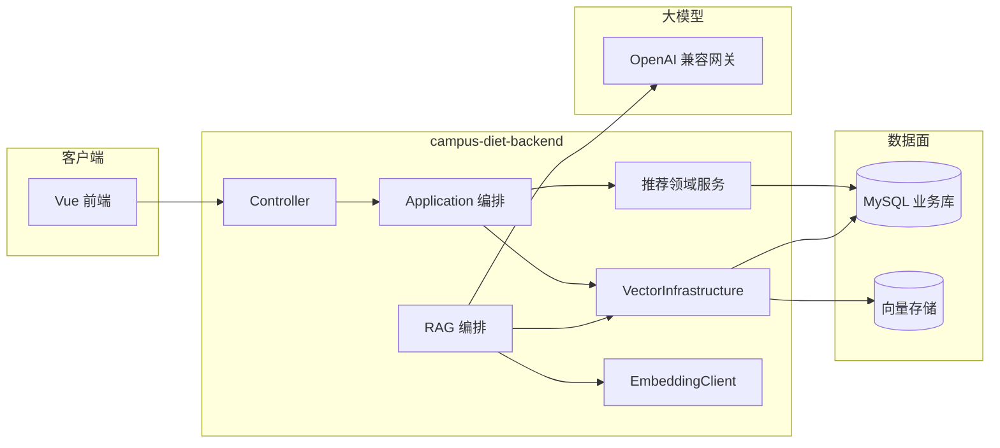

# 企业级向量检索与 RAG 落地方案（medican / 校园药膳）

## 文档定位

本文档在 **不改变仓库既定技术栈大前提**（Spring Boot 2.7、Java 11、Vue 3、可选 MySQL、OpenAI 兼容 LLM、`system_kv` 运营开关、`RuntimeMetricService` 可观测、`ProdSecurityBaselineValidator` 生产基线）下，描述如何把 **向量召回、向量索引生命周期、检索增强生成（RAG）** 做成可上线、可审计、可回滚的 **企业级能力**，并与 [`项目优化方向建议.md`](项目优化方向建议.md)、[`AI问答与Skill集成优化方向.md`](AI问答与Skill集成优化方向.md) 中的 **P0～P2 优先级** 与 **Skill / 路由 / 指标** 思路对齐。

**不在本文展开**：具体厂商控制台截图、某一 embedding 模型的精调参数；实施时以所选向量库与模型文档为准。

---

## 一、目标与非目标

### 1.1 业务目标

| 能力域 | 用户价值 | 与现有代码的衔接点（概念层） |
|--------|----------|------------------------------|
| 语义搜索 / 召回 | 自然语言找药膳，补全 `LIKE` 与标签字面匹配 | `RecommendApplicationService` 候选集、`RecipeMapper` 关键词分支 |
| 场景疗愈增强 | 症状/场景描述与功效文本的语义相近 | `SceneTherapyService` 排序前召回或 rerank |
| RAG（食疗 / 膳食） | 生成内容绑定真实 `recipeId` 与库内字段，降幻觉 | `AiTherapyPlanGenerationOrchestrator`、`AiDietService` 调用 LLM 前 |
| 管理端治理 | 相似菜谱聚类、重复上架提示、运营侧语义检索 | Admin 列表与导入流水线（按需） |

### 1.2 企业级非功能目标（必须纳入设计）

- **安全**：API Key、向量库凭证、embedding 端点 URL **仅环境变量 / 密钥管理**；生产基线继续由 `ProdSecurityBaselineValidator` 与 CI 脚本约束；日志 **不落用户原文 + 不落全量向量**（或脱敏 / 采样）。
- **可靠**：索引写入失败不阻断主链路；**降级**为现有规则推荐 + `LIKE`；超时、熔断、重试预算明确。
- **可观测**：沿用 `RuntimeMetricService` 键命名习惯，例如 `vector.recall.latency_ms`、`vector.index.write.fail`、`rag.retrieve.hit_count`；管理端可汇总到现有 observability 思路（参见 `docs/observability-metrics.md` 若已存在）。
- **可运维**：索引 **版本号**（embedding 模型 + 维度 + 切块策略哈希）、**重建任务**（批跑、进度、幂等）、**双写/蓝绿** 切换策略。
- **可测试**：契约测试对「向量关闭 / 模拟 TopK」仍可绿；核心排序逻辑单测不依赖外网 embedding。

### 1.3 非目标（第一期可不建）

- 多区域异地多活向量集群（除非业务量明确要求）。
- 实时学习用户 embedding（可先离线或 T+1 聚合）。
- 替代全部规则推荐（向量应定位为 **召回 / 重排层**，与 [`RecommendScoringDomainService`](../../campus-diet-backend/src/main/java/com/campus/diet/domain/recommend/RecommendScoringDomainService.java) 并存）。

---

## 二、与项目「优化方案」的优先级映射

对齐 [`项目优化方向建议.md`](项目优化方向建议.md) 的 **P0 / P1 / P2**：

### P0（与向量能力同时满足的底线）

1. **密钥与配置**：embedding API、向量库密码、自建推理网关 URL **禁止**写入可提交默认配置；与现有 LLM 变量策略一致。
2. **失败默认安全**：向量服务不可用 → **自动关闭**语义召回（`system_kv` 或配置项），业务接口行为与当前版本一致，并打指标 `vector.degraded=1`。
3. **CI 与测试**：新增模块须有 **单测 + Mock 检索端口**；不在 PR 中强依赖公网 embedding（可用固定向量 fixture 或 Testcontainers 选型后补）。
4. **生产基线**：若向量组件引入新的「必须非空」密钥，同步更新 `ProdSecurityBaselineValidator` 与 `docs/security-baseline-checklist.md`（与现有 LLM/JWT 同一节奏）。

### P1（架构可维护性）

1. **分层**：建议新增包边界示例（与现有推荐分层一致）：
   - `domain.vector`：召回策略、融合打分接口（纯领域，无 HTTP）。
   - `application.rag`：编排「检索 → 拼 prompt → 调 LLM」。
   - `infrastructure.vector`：具体向量库客户端、embedding 客户端、DTO 映射。
2. **与 AI Skill 文档对齐**：RAG 片段注入视为 **动态 Skill 块**（见下一节），版本与哈希进入日志/指标，避免与 [`AI问答与Skill集成优化方向.md`](AI问答与Skill集成优化方向.md) 中「不可观测的 prompt 堆叠」相冲突。

### P2（性能与成本）

1. **候选窗**：继续复用 `campus.recommend.candidate-window-size` 思路；向量 TopK 不宜过大（建议先 **20～80** 再与规则融合）。
2. **异步索引**：菜谱保存、批量导入走 **异步任务** 写向量，避免阻塞管理端 HTTP 线程。
3. **缓存**：对「同一菜谱摘要」的 embedding 做 **内容哈希缓存**（进程内或 Redis，视规模），降低费用与延迟。

---

## 三、与 AI Skill / 路由 的协同（RAG 企业形态）

对齐 [`AI问答与Skill集成优化方向.md`](AI问答与Skill集成优化方向.md)：

| 概念 | 企业级落地 |
|------|------------|
| Skill 化 | 新增 classpath 或 DB 片段：`rag.retrieval-policy@1`（引用哪些表字段、如何引用 id）、`rag.citation-format@1`（强制输出 `recipeId` 列表） |
| 路由 | 沿用 `TherapyPlanLlmRoute` 思路：短输入 / 无检索命中时 **不注入长 RAG 块**，避免 token 膨胀 |
| 指标 | `skill_set_id` + `rag_corpus_version` + `retrieve_latency_ms` + `topk_ids_hash`（非原文） |
| 方案 C（Tool） | 第二期：将 `retrieve_recipes(query)` 做成真正 tool，与文档中「限定场景试点」一致；第一期可用 **同步检索 + system 注入** 降低复杂度 |

**合规**：RAG 上下文仍受 `shared/core-compliance@1` 约束；检索片段仅来自 **已发布 status** 的药膳与脱敏字段。

---

## 四、总体架构（推荐）

**数据流要点**：

1. **写入路径**：`Recipe` / 场景文案变更 → 领域事件或应用服务 → **切块** → **embedding** → 写入 `VS`（附 `corpus_version`、`recipe_id`、`chunk_id`）。
2. **读取路径**：用户 query → **embedding** → `VS` TopK →（可选）MySQL **按 id 补全**最新字段 → 融合进推荐或 RAG prompt。
3. **一致性**：以 MySQL 为权威；向量索引 **最终一致**；管理端展示「索引状态」列（pending / ready / failed）。

---

## 五、向量存储选型（企业级对比）

| 方案 | 优点 | 缺点 | 与 medican 适配 |
|------|------|------|-----------------|
| **A. 专用向量库**（Qdrant / Milvus / Weaviate 等） | ANN 成熟、过滤标签强、易水平扩展 | 多组件运维、同步链路 | 适合 **菜谱过万** 或需复杂 metadata 过滤 |
| **B. PostgreSQL + pgvector** | SQL 事务、与 JSONB 审计表同库 | 需引入 PG 或与现有「全 MySQL」决策冲突 | 适合希望 **强一致 + 少新物种** 的团队 |
| **C. MySQL 8 + 向量类型**（若版本与运维允许） | 不引入新数据库种类 | 版本/索引能力依赖发行版；ANN 参数需验证 | 与现有 `mysql` profile 最顺，但要做 **容量与延迟** 压测 |
| **D. 云托管向量索引** | 免运维、弹性 | 成本、合规、出站网络策略 | 适合已上云且接受 SaaS |

**建议**：单人全栈、当前规模中等时，优先 **方案 A 单节点 Docker** 或 **方案 C（在 MySQL 版本满足前提下）**；在 [`项目优化方向建议.md`](项目优化方向建议.md) 的 **方案 A：稳健增量** 下，先 **Docker Compose  profiles** 增加可选 `vector` 服务，默认关闭，与本机 H2 开发互不强制。

---

## 六、索引设计（企业级元数据）

每条向量建议至少携带：

| 字段 | 说明 |
|------|------|
| `id` | 全局唯一：`recipe:{id}:chunk:{n}` 或 `scene:{id}` |
| `vector` | float 数组，维度与模型一致 |
| `recipe_id` / `scene_id` | 回表主键 |
| `chunk_text` | 可不在索引存全文，仅存 hash；全文以 MySQL 为准 |
| `status` | 与业务 `status` 对齐，过滤已下线 |
| `corpus_version` | 模型名 + 切块策略 + 代码版本哈希 |
| `updated_at` | 增量重建与对账 |

**切块策略**：标题 + 功效摘要 + 功效标签为一 chunk；步骤与禁忌单独 chunk；避免单 chunk 超大导致检索漂移。

---

## 七、API 与运营开关（建议）

- **配置**：`VECTOR_ENABLED`、`VECTOR_URL`、`VECTOR_API_KEY`、`EMBEDDING_BASE_URL`、`EMBEDDING_MODEL`、`EMBEDDING_API_KEY`（命名示例，实施时与 `application-*.yml` 风格统一）。
- **`system_kv` 键**（与现有 `recommend.global.enabled`、`ai.generation.enabled` 同模式）：
  - `vector.recall.enabled`：总开关。
  - `vector.recipe.index.enabled`：是否写索引。
  - `rag.therapy.enabled`：食疗方案是否走 RAG。
- **管理端（可选）**：只读展示索引水位 + 手动触发「全量重建」按钮（异步任务 ID 可查询）。

---

## 八、分阶段里程碑（与 AI 文档 M1～M4 对齐）

| 阶段 | 产出 | 验收标准 |
|------|------|----------|
| **V0** | 设计定稿 + compose 可选向量服务 + 开关默认关 | 无向量时全量测试绿；prod 基线不因新增空配置而误启动通过 |
| **V1** | 仅 **菜谱语义召回** 接入推荐候选（keyword 非空或独立参数） | 延迟 P95 预算内；降级路径验证；指标齐全 |
| **V2** | **食疗 RAG**：检索 TopK → Skill 动态块 → 现有治理链路 | 输出中可解析 `recipeId` 与库内一致；prompt budget 指标不异常飙升 |
| **V3** | 场景疗愈 rerank + 管理端相似度提示 | 与规则排序 A/B 可配置 |
| **V4** | Tool 调用检索（对齐 AI 文档方案 C） | 仅对启用上游且通过联调的 profile 开放 |

---

## 九、风险与缓解

| 风险 | 缓解 |
|------|------|
| embedding 供应商变更导致向量空间漂移 | `corpus_version` 强制重建；双版本并行短窗对比 |
| RAG 注入过长挤占用户输入 | 路由 + token 预算 + TopK 限制；短版 Skill |
| 索引与 MySQL 不一致 | 定时对账任务；管理端展示 `last_indexed_at` |
| 费用与速率限制 | 批量 embedding、缓存、离线任务错峰 |
| 安全与隐私 | 检索日志脱敏；合规 Skill 不变；生产密钥不入库 |

---

## 十、文档维护

- **Owner**：与主仓库维护者一致（单人项目可仅维护更新日期与里程碑状态）。
- **关联阅读**：[`项目优化方向建议.md`](项目优化方向建议.md)、[`AI问答与Skill集成优化方向.md`](AI问答与Skill集成优化方向.md)、根目录 [`README.md`](../../README.md)、[`docs/security-baseline-checklist.md`](../security-baseline-checklist.md)。

---

*版本：2026-04-18；状态：规划稿（实现以仓库后续 PR 为准）。*
