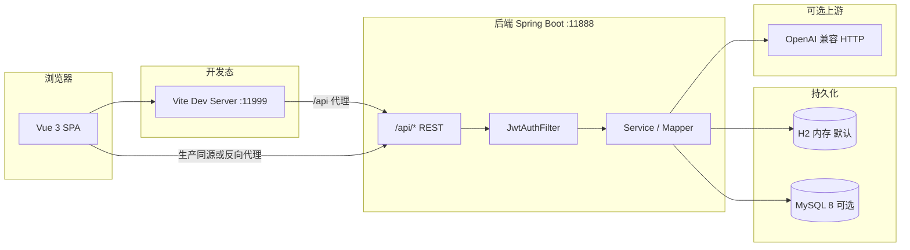

# Medican（校园药膳推荐）技术白皮书

**版本**：与仓库当前实现同步（文档日期以 Git 提交为准）  
**范围**：`tcm-diet-frontend`（浏览器 Web 应用）与 `campus-diet-backend`（REST API）及其运维脚本与配置约定。

---

## 1. 文档目的与读者

本白皮书描述当前仓库的**技术事实**：系统边界、架构、技术选型、数据与安全模型、运行与部署要点，以及可观测性与测试门禁。  
**读者**：实施/运维人员、二次开发者、验收或审计方。产品功能说明见同目录 `产品手册.md`；交付与操作步骤见同目录 `项目交付手册.md` 与仓库根目录 `README.md`。

---

## 2. 产品与技术边界

| 维度 | 说明 |
|------|------|
| 产品形态 | 以浏览器为主的 **B/S** 应用；前端 SPA，后端 **无状态 REST**（会话凭 **JWT**，非 Cookie 会话）。 |
| 业务域 | 校园场景下的药膳/食材内容、推荐与个性化、场景疗愈内容、管理端内容与用户管理、可选 **OpenAI 兼容 LLM** 食疗/膳食生成。 |
| 非目标（当前实现侧重） | 非多租户 SaaS 隔离说明；生产高可用拓扑需另行设计（仓库提供单机联调与安全基线）。 |

---

## 3. 系统架构

### 3.1 逻辑架构

- **开发联调**：前端 `http://localhost:11999`（`vite.config.js` 中 `strictPort: true`），通过 **Vite 代理**将 **`/api`**（及与 `VITE_API_PREFIX` 对齐的路径）转发至 **`VITE_PROXY_TARGET` 或默认 `http://127.0.0.1:11888`**，避免 `localhost` → IPv6 与后端仅监听 `127.0.0.1` 的不一致。
- **后端监听**：默认 **`server.address=127.0.0.1`**；局域网访问需 **`SERVER_ADDRESS=0.0.0.0`**。

### 3.2 仓库物理结构（常用）

| 路径 | 职责 |
|------|------|
| `tcm-diet-frontend/` | Vue 3 + Vite 6 源码、ESLint、vue-tsc、Playwright e2e |
| `campus-diet-backend/` | Spring Boot 2.7.x、Java 11、MyBatis-Plus、JWT、Actuator |
| `scripts/` | JDK/Maven 选择、后端测试、MySQL 授权与开发实例、构建与探测脚本 |
| `docs/` | 安全基线、可观测性字段等专项文档 |
| `docker-compose.mysql-dev.yml` | 可选本地 MySQL 8 容器与初始化 SQL 挂载 |

---

## 4. 技术栈总览

### 4.1 前端

| 类别 | 技术 |
|------|------|
| 框架 | Vue **3.5**、Vue Router **4**、Pinia（含持久化插件） |
| 构建 | Vite **6**、`@vitejs/plugin-vue` |
| UI | **Element Plus**（管理端等）、**Vant**（移动端场景） |
| HTTP | Axios |
| 可视化 | ECharts 6 |
| 质量 | ESLint 9、TypeScript ~5.7、vue-tsc、**Playwright** e2e |
| 开发辅助 | 未设置 `VITE_AI_MOCK=0` 时加载 `vite-plugins/aiApiDevMock.js` 对 AI 相关请求做开发 Mock |

### 4.2 后端

| 类别 | 技术 |
|------|------|
| 运行时 | Java **11**、Spring Boot **2.7.18** |
| Web | `spring-boot-starter-web`、`starter-validation` |
| 持久化 | **MyBatis-Plus** 3.5.5；驱动 **mysql-connector-j**（runtime） |
| 安全 | 自研 **JWT**（jjwt 0.11.5）、`spring-security-crypto`（口令哈希）；**非完整 Spring Security Filter 链**，鉴权以 `JwtAuthFilter` + 路径白名单为主 |
| 可观测性 | **Actuator**：暴露 `health`、`prometheus`；Micrometer Prometheus registry |
| 工具 | Lombok |

---

## 5. 后端模块与 API 面（按控制器）

后端主包 `com.campus.diet`，REST 入口位于 `controller` 包（节选）：

| 区域 | 控制器 | 典型职责 |
|------|--------|----------|
| 公共/健康 | `HealthController` | 健康检查（含 `/health` 等约定） |
| 认证 | `AuthController` | `/api/auth/login`、`register`、`logout` |
| 用户 | `UserController` | 用户侧资料等 |
| 内容/场景 | `CampusSceneController`、`SceneTherapyController` | 校园场景、场景疗愈与关联药膳 |
| 菜谱 | `RecipePublicController` | 公开菜谱查询 |
| 业务行为 | `FavoriteHistoryController`、`FeedbackApiController` | 收藏/历史、反馈 |
| 日历 | `CampusWeeklyCalendarController` | 食堂周历 |
| AI | `AiDietController` | 膳食/食疗相关 LLM 调用与兜底 |
| 管理端 | `admin/*` | 仪表盘、用户、菜谱、食材、周历、系统 KV、AI 质量等 |

**统一响应与异常**：`GlobalExceptionHandler`、`ApiResponse` 等约定前后端错误码与 JSON 结构（细节以代码为准）。

---

## 6. 数据模型与初始化

### 6.1 核心表（`classpath:db/schema.sql` 及补丁 SQL）

代表性实体包括：

- **`sys_user`**：账号、角色（如 `USER` / `ADMIN` / `CANTEEN_MANAGER`）、逻辑删除字段 `deleted`
- **`user_profile`**：体质、季节、问卷 JSON、推荐/采集开关
- **`campus_scene`**、`scene_recipe`**：场景与菜谱多对多
- **`recipe`**、**`ingredient`**、**`recipe_ingredient`**：药膳、食材及关联
- 另有周历、收藏、浏览、反馈、系统 KV 等表（见完整 `schema.sql`）

**逻辑删除**：MyBatis-Plus 全局配置 `logic-delete-field: deleted`。

### 6.2 配置画像：`h2` 与 `mysql`

- **默认 Profile**：`spring.profiles.default=h2`（`application.yml`），便于零依赖本机启动。
- **MySQL**：`SPRING_PROFILES_ACTIVE` 含 `mysql` 时加载 `application-mysql.yml`，并可加载 **`config/medican-datasource.override.yml`**（示例见 `medican-datasource.override.example.yml`）。
- **JDBC**：支持 **`createDatabaseIfNotExist=true`**（账号具备 CREATE 时自动建库）；主机/库名/账号等由 **`MYSQL_*`** 或 **`SPRING_DATASOURCE_URL`** 覆盖。

### 6.3 SQL 初始化与种子数据

- **`spring.sql.init`**：默认执行 `schema` 多文件（含补丁）与 **`data.sql`**；生产 **`application-prod.yml`** 将 **`spring.sql.init.mode`** 设为 **`never`**。
- **业务种子**（非 prod 默认）：如 `SeedUsersRunner`、`SeedMockRecipesRunner`、`SeedCampusScenesTherapyRunner` 等，由 `campus.diet.*` 与 `campus.seed-users.*` 开关及环境变量控制；**生产基线禁止**默认演示种子口令与高风险种子开关（见第 7 节）。

---

## 7. 安全模型与生产基线

### 7.1 认证与授权

- **JWT**：签发载荷包含用户 id、username、role；请求头 Bearer 传递。过滤器 **`JwtAuthFilter`** 仅注册在 **`/api/*`** 路径（见 `application.yml` 注释与 `WebConfig`），**CORS 过滤器顺序早于 JWT**，保证 OPTIONS 预检与错误响应均带 CORS 头。
- **白名单**：登录/注册等认证接口允许携带过期 token 等行为在过滤器内单独处理（见 `JwtAuthFilter` 注释）。

### 7.2 CORS

- 默认 **`CAMPUS_CORS_ALLOWED_ORIGIN_PATTERNS=*`** 便于多 Origin 开发；**生产应收紧**为逗号分隔模式列表。  
- **`CAMPUS_CORS_INCLUDE_LOOPBACK_DEV_PATTERNS`**：列举式 CORS 时是否合并 loopback（`WebConfig` / 各 profile 默认值不同）。

### 7.3 生产启动硬性校验（`ProdSecurityBaselineValidator`）

当激活 **`prod`** Profile 时，启动期 **`@PostConstruct`** 校验包括但不限于：

- 数据源账号非空且**非 `root`**；密码非弱口令集合且非占位默认值
- **`CAMPUS_JWT_SECRET`**：长度 ≥ 32，且不得包含开发默认子串
- **`LLM_API_KEY`** 非空
- **`spring.sql.init.mode`** 不得为 `always`
- 关闭 **`seed-mock-recipes` / `seed-demo-interactions` / `seed-weekly-calendar`**
- 种子用户口令不得仍为开发默认值

详细清单见 **`docs/security-baseline-checklist.md`**。

---

## 8. 大模型（LLM）集成

- **协议**：OpenAI 兼容 **`/v1/chat/completions`** HTTP。
- **配置**：`llm.url` 默认由 **`LLM_HTTP_HOST` / `LLM_HTTP_PORT`** 拼接，可用 **`LLM_URL`** 覆盖；**`LLM_MODEL`**、**`LLM_API_KEY`**、**`LLM_TIMEOUT_MS`**。
- **业务开关**：`campus.ai.enabled`、`campus.ai.mock`（为 true 时走本地拼装，不调用上游）。
- **路由与提示词**：支持食疗 system 路由覆盖、classpath 下 **runtime-llm Skill** 资源前缀与膳食 system prompt 资源路径（见 `application.yml` 中 `campus.ai` 与 `TherapyPlanLlmRoute` 等实现）。

---

## 9. 推荐与其它业务配置

`application.yml` 中 **`campus.diet.recommend`** 定义推荐算法路径（如 **rules**）、候选窗口、体质/季节与热度权重等，供推荐服务读取；具体算法实现以后端代码为准。

---

## 10. 可观测性与运维

- **指标**：Actuator **`/actuator/prometheus`**；应用名标签 `spring.application.name`。
- **管理端**：具备权限的会话可访问运行时指标与摘要（见 `README.md` 索引的 **`docs/observability-metrics.md`**）。
- **环境变量**：`README.md` 与 `application.yml` 提供 **`SERVER_ADDRESS`**、**`MYSQL_*`**、**`SPRING_SQL_INIT_MODE`**、**`SEED_*_PASSWORD`**、**`CAMPUS_JWT_SECRET`**、**`CAMPUS_CORS_*`** 等速查。

**Windows 脚本**：`启动后端.bat`、`启动前端.bat`、`启动MySQL开发实例.bat`、`scripts/Run-BackendTests.ps1` 等与 **`MEDICAN_DEV_TOOLS`**、Maven Wrapper 约定见 **`AGENTS.md`**。

---

## 11. 测试与 CI 相关门禁

| 层级 | 说明 |
|------|------|
| 后端 | JUnit / Spring Test；`scripts/Run-BackendTests.ps1` 一键；含 **`ProdSecurityBaselineValidatorTest`**、**`JwtAuthFilterTest`**、**`CorsJwtPreflightMockMvcTest`** 等 |
| 前端单元 | `npm run test`（tsx test） |
| 前端类型 | `npm run typecheck`（vue-tsc） |
| 前端 e2e | Playwright；CI 门控 **`npm run test:e2e:ci`**（preview + 固定端口，见 `package.json`） |
| 供应链 | `npm audit --audit-level=critical`；GitHub Actions  supply chain 工作流见仓库 `.github/workflows/` |

---

## 12. 已知限制与演进索引

- **文档与清单**：未完成项与路线见 `docs/C-1-未完成事项.md`、`路径2-未完成项清单.md`、`优化pro.md`（与 `README.md` 索引一致）。
- **依赖说明**：前端 `xlsx` 等可能在 `npm audit` 中有已知 advisory，README 已说明场景与替换权衡。
- **单人维护约定**：`.cursor/rules/solo-developer.mdc`。

---

## 13. 术语与缩写

| 术语 | 含义 |
|------|------|
| JWT | JSON Web Token |
| SPA | Single Page Application |
| CORS | Cross-Origin Resource Sharing |
| LLM | Large Language Model |

---

**声明**：本白皮书依据仓库当前文件归纳；接口字段与行为以源码及 OpenAPI（若后续引入）为准。修订时请同步更新版本说明或提交信息。
