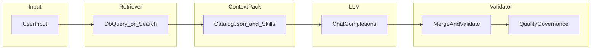

# 校园药膳项目：知识库观念与落地说明

本文说明在本仓库语境下，**「知识库」**一词可能指代的两种含义，以及如何把**业务数据当作可检索、可引用的知识（compound knowledge）**与现有 **Skill 化大模型调用**结合起来理解与演进。面向未来复盘、答辩与二次开发，避免把「向量 RAG」与「已有 catalog 注入」混为一谈。

---

## 1. 背景与术语

### 1.1 两种「知识库」

| 称呼 | 含义 | 在本项目中的典型载体 |
|------|------|----------------------|
| **文档知识库** | 方法论、约定、排障路径、演进路线图 | [AI问答与Skill集成优化方向.md](./AI问答与Skill集成优化方向.md)、[优化pro.md](./优化pro.md)、仓库根目录 [AGENTS.md](../../AGENTS.md)、观测文档 [observability-metrics.md](../observability-metrics.md) 等 |
| **业务复合知识（compound knowledge）** | 药膳菜谱、场景、体质标签、食材与功效描述等**可对用户与模型披露的事实子集** | 关系型数据库中的 `Recipe` 等实体、JSON 种子与 bootstrap 资源、未来可扩展的条文/长文档分块 |

二者关系可以一句话写死：

- **文档知识库**约束的是：**怎么组织调用**（Skill 拼装、路由、指标、是否上 Tool/RAG）。
- **业务知识**约束的是：**模型在本次请求中被允许引用什么**（例如只能引用注入目录里的 `recipeId`）。

缺少前者，提示词与运维会失控；缺少后者，模型容易「凭参数记忆编造」菜谱或疗效，与校园科普定位冲突。

### 1.2 compound knowledge（复合知识）

在工程上指：来自**多源**（库表、配置、运营录入、未来文档库）的结构化或非结构化片段，经**检索或筛选**组成**本次请求的上下文包（context pack）**，再进入 LLM。它强调：

1. **可检索**：不是把整库塞进 prompt。
2. **可引用**：输出中的事实锚点能回到库里的主键或片段 id。
3. **可审计**：日志/指标能记录「用了哪套 Skill、哪段上下文哈希」，而非用户隐私原文（与现有实现对齐）。

---

## 2. 现状解剖：食疗 AI 链路里「已经在用的」知识落地

当前 **AI 食疗方案**路径**不是**向量检索 RAG，但已经具备手册 [AI问答与Skill集成优化方向.md §6](./AI问答与Skill集成优化方向.md) 所说的「与数据库强绑定」方向的**前置形态**：** popularity 预筛池 + 硬边界 catalog + Skill 合同**。

### 2.1 环节与代码锚点

| 环节 | 事实行为 | 关键文件 |
|------|-----------|----------|
| 菜谱池来源 | 从库查询最多 **60** 条 `status = 1` 的菜谱，按 `collect_count` 降序 | [`AiTherapyPlanRecipePoolLoader.java`](../../campus-diet-backend/src/main/java/com/campus/diet/service/ai/AiTherapyPlanRecipePoolLoader.java)（`DEFAULT_POOL_LIMIT = 60`） |
| 注入模型上下文 | `buildCatalogJson` 取池中前 **48** 条，序列化为 JSON 数组，元素仅含 `id` 与 `name` | [`AiTherapyPlanLlmPromptBuilder.java`](../../campus-diet-backend/src/main/java/com/campus/diet/service/ai/AiTherapyPlanLlmPromptBuilder.java) |
| 编排 | 功能开关与指标 → 加载池 → 解析 Skill 路径 → 装配 system（含 catalog）→ 调用上游 → `mergeAndValidate` 与质量治理 | [`AiTherapyPlanGenerationOrchestrator.java`](../../campus-diet-backend/src/main/java/com/campus/diet/service/ai/AiTherapyPlanGenerationOrchestrator.java) |
| 「只能引用目录内 id」 | Skill 正文声明目录约束；装配器把 catalog 拼进 system | [`context.recipe-catalog@1.txt`](../../campus-diet-backend/src/main/resources/llm-skills/runtime-llm/therapy-plan/context.recipe-catalog@1.txt)、[`TherapyPlanLlmSkillAssembler.java`](../../campus-diet-backend/src/main/java/com/campus/diet/service/ai/TherapyPlanLlmSkillAssembler.java) |
| 用户侧信号 | 主诉、体质标签进入 **user** 消息模板，与「短输入」路由联动 | 同目录 [`AiTherapyPlanLlmPromptBuilder.buildUserMessage`](../../campus-diet-backend/src/main/java/com/campus/diet/service/ai/AiTherapyPlanLlmPromptBuilder.java) |

### 2.2 当前设计的边界与含义

1. **池与主诉未强绑定**：池按收藏量排序，主诉与体质主要在 user 文本与后续校验中起作用；若未来要做「症状驱动菜谱」，属于 **L1** 演进（见下节），而非推翻现有架构。
2. **catalog 字段稀疏**：仅 `id`/`name`，有利于控制 token，但模型对菜谱细节的了解仍部分依赖参数化「常识」——因此 **合规 Skill + 输出校验 + 兜底** 仍然关键。
3. **与推荐_feed 的关系**：推荐域可走规则分、行为分等（如 [`RecipeRecommendService`](../../campus-diet-backend/src/main/java/com/campus/diet/service/RecipeRecommendService.java)）；**LLM 可引用集合**可以与之共用数据源，但策略不必相同：推荐求「列表体验」，食疗求「可引用、可校验的闭集」。

---

## 3. 推荐落地路径：L0 → L3

每一层都建议写清：**输入信号、检索物、注入位置（system / user / tool 结果）、验收要点、主要风险**。

### L0（现状）：全局热门池 + catalog + Skill

- **输入**：主诉文本、体质代码（经标签化进 user）。
- **检索物**：数据库热门子集 → 截断为 catalog JSON。
- **注入**：catalog 进 **system**（与多段 Skill 拼接）；合规见 [`shared/core-compliance@1.txt`](../../campus-diet-backend/src/main/resources/llm-skills/runtime-llm/shared/core-compliance@1.txt)。
- **验收**：生成结果中的 `recipeId` 落在目录内；上游失败可走本地兜底（编排器内分支）。
- **风险**：池与用户需求不一致时，模型仍可能「泛泛而谈」；靠路由（如 brief 输入）与质量治理缓解。

### L1（低成本，可不引入向量库）：查询驱动的动态 catalog

- **输入**：主诉关键词、体质、季节、场景标签等。
- **检索物**：SQL / 简单全文 / 标签交集得到的 **更小候选集**，再生成与 L0 同形态的 catalog（仍保持「仅可引用目录 id」）。
- **注入**：仍在 system 侧 catalog；Skill 合同可复用或增加「检索依据」一句说明（注意 token）。
- **验收**：同一用户输入下，catalog 随库数据变化可重复、可测；单测可固定种子数据断言 id 集合。
- **风险**：检索逻辑错误会导致「闭集过窄或过宽」；需监控与回退策略。

### L2（手册方案 C / M4）：Tool 或显式编排步骤

手册在 [AI问答与Skill集成优化方向.md §6「方案 C」](./AI问答与Skill集成优化方向.md) 中描述了 Tool / 结构化输出方向，并给出**落地门槛**（摘要）：

1. 业务上必须依赖**实时库/检索**且纯 prompt 幻觉成本不可接受。
2. 上游 API 已稳定支持 `tools` 或 structured output，且与 [`LlmChatClient`](../../campus-diet-backend/src/main/java/com/campus/diet/service/LlmChatClient.java)（或其后继抽象）契约对齐。
3. 具备 tool 调用的超时、熔断、指标与回退路径设计。

- **做法**：「查菜谱 / 查场景 / 查条文」成为真正工具或内部步骤；**Skill 只描述何时调用、如何合并、如何引用 id**，事实以工具返回为准。
- **验收**：可记录每次请求 tool 调用次数与延迟；失败可降级到 L1/L0。
- **风险**：实现与联调成本高；多上游行为差异（见手册 §10）。

### L3（可选向量 RAG）：长文档与非结构化补充

- **适用**：药材长描述、白皮书节选、古籍白话摘要等**长文本**，且需要语义近似匹配时。
- **与 L0–L2 关系**：向量检索应视为对 **context pack** 的**补充层**，而不是替代数据库主键与校验；输出仍应能通过 id/片段引用回溯。
- **验收**：召回命中率、空召回比例、引用片段与生成内容一致性抽检。
- **风险**：上下文膨胀、版权与合规表述、「检索到的不宜直接复述」的内容需过滤。

### 3.1 数据流对照（概念图）

下图标出与当前编排器大致对应的阶段；**Retriever** 在 L0 为「固定 SQL 排序」，在 L1+ 可为关键词/向量。

---

## 4. 与手册观念的显式对齐

### 4.1 Skill 化与命名空间

- **runtime-llm.\***：线上用户请求触发的 LLM 片段，位于 [`campus-diet-backend/src/main/resources/llm-skills/runtime-llm/`](../../campus-diet-backend/src/main/resources/llm-skills/runtime-llm/)。
- **dev-agent.\***：面向人类与编码智能体的 Cursor / Claude skills（如仓库 `.claude/skills`），与线上推理**不应混用同一份文件**，避免误把开发提示词当生产 Skill。详见手册 [§5](./AI问答与Skill集成优化方向.md)。

### 4.2 可观测性

与手册 [§7、§12](./AI问答与Skill集成优化方向.md) 一致，线上应能回答：

- 本次食疗生成走了哪条 **skill set**（如 default / brief）？
- **system** 内容哈希与 prompt 体量指标是否异常？

详细键名与 HTTP 观测见 [observability-metrics.md](../observability-metrics.md)、原始快照字段见 [observability-runtime-metrics.md](../observability-runtime-metrics.md)。管理端摘要若已接入，可对照手册中的 `observability-summary` 描述。

### 4.3 功能开关与运营配置

生成是否开启等可由 `system_kv` 与配置覆盖（手册与 [优化pro.md](./优化pro.md) 均有归纳）。**扩大检索范围或接入 RAG 时**，建议同步评审开关默认值与降级路径，避免「能力开了、治理没跟上」。

---

## 5. 检索扩域与合规、校验、指标必须同步

**知识越多 ≠ 越安全。** 当 L1–L3 扩大模型可见事实范围时，下列四项应视为同一版本交付，而不是「先上检索再说」。

### 5.1 合规（Skill 层）

共享合规片段 [`core-compliance@1.txt`](../../campus-diet-backend/src/main/resources/llm-skills/runtime-llm/shared/core-compliance@1.txt) 与食疗身份、输出 schema 等共同构成安全边界。检索引入新文本源时，要评估：

- 是否含有**医疗承诺、诊断暗示**等不宜展示内容；
- 是否需要在入库或检索阶段做黑名单/脱敏。

### 5.2 校验与治理（代码层）

编排器在调用上游后依赖 **JSON 解析、`mergeAndValidate`、[`AiTherapyPlanQualityGovernance`](../../campus-diet-backend/src/main/java/com/campus/diet/service/ai/AiTherapyPlanQualityGovernance.java)** 等路径收敛输出。若 catalog 或 tool 返回结构变化，必须同步：

- 字段校验与白名单 id 检查；
- 兜底模板与错误码行为（避免把半合法 JSON 直接暴露给前端）。

### 5.3 指标与排障（运维层）

沿用手册 [§12 排障表](./AI问答与Skill集成优化方向.md) 的思路：现象 → `system_kv` / 环境变量 → 进程内指标 → 日志锚点。检索或 RAG 上线后建议增加：

- 召回条数、空召回率、tool 超时率；
- prompt 总长度分布（已有 prompt_budget 相关计数时可对比前后）。

### 5.4 小结

| 维度 | 与「业务知识」演进的关系 |
|------|-------------------------|
| Skill | 定义「能做什么、不能做什么、输出长什么样」 |
| 检索/RAG | 定义「这次对话基于哪些事实子集」 |
| 校验治理 | 定义「模型输出哪些能放行给用户」 |
| 指标日志 | 定义「出问题能否两分钟定位到哪一层」 |

---

## 6. 延伸阅读

| 文档 | 用途 |
|------|------|
| [AI问答与Skill集成优化方向.md](./AI问答与Skill集成优化方向.md) | Skill 拼装、方案 A/B/C、M 里程碑、排障 §12 |
| [大模型调用调试说明.md](./大模型调用调试说明.md) | 本地/上游、环境变量、前端调试习惯 |
| [优化pro.md](./优化pro.md) | 项目优先级与 AI 侧风险归纳 |
| [observability-metrics.md](../observability-metrics.md) | 指标键名与派生字段 |
| [observability-runtime-metrics.md](../observability-runtime-metrics.md) | 原始快照字段 |
| [AGENTS.md](../../AGENTS.md) | 仓库模块速览与本地运行约定 |

---

*文档版本：与 `campus-diet-backend` 食疗编排现状对齐；若代码中池大小、catalog 条数或 Skill 文件名变更，请同步更新 §2 表格与链接。*
